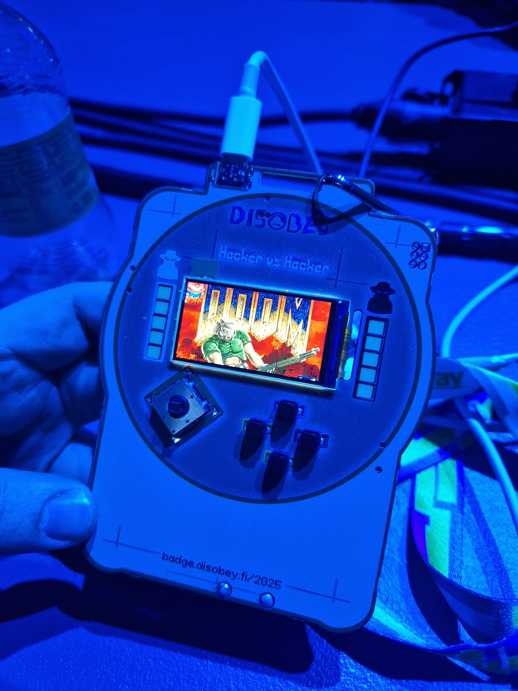
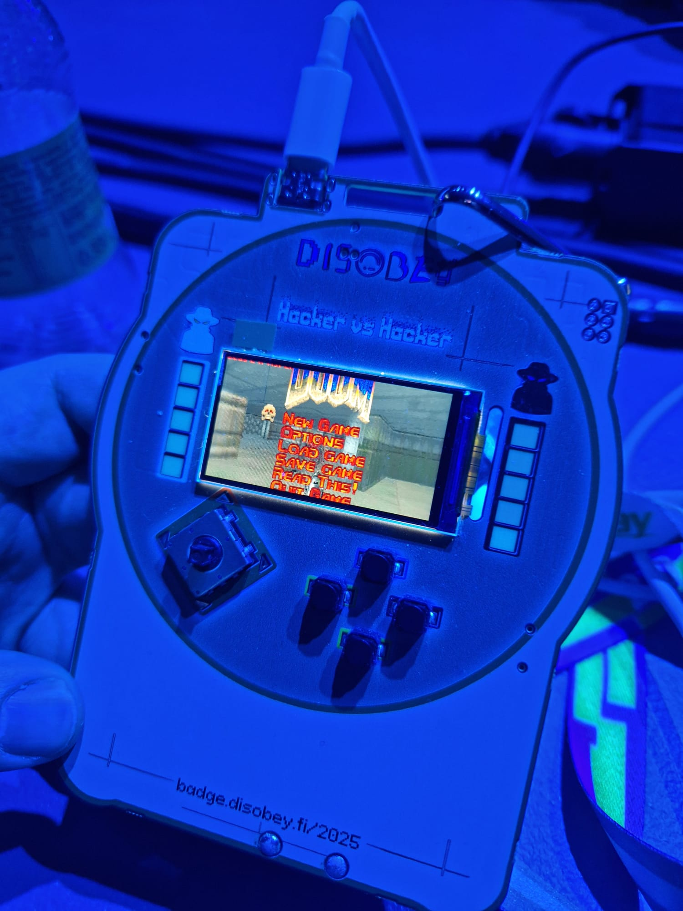
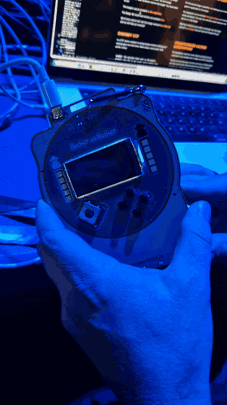

# DOOM on Disobey 2025/2026 Badge

PrBoom (DOOM engine) port for the [Disobey 2025/2026 Badge](https://badge.disobey.fi/2025/) hardware (ESP32-S3 with ST7789 320x170 display).

Based on [ESP32-DOOM](https://github.com/AmirhoseinMasoumi/ESP32-DOOM) by AmirhoseinMasoumi, adapted for the badge by [zdvhm](https://github.com/zdvhm) and atj.

Disobey 2026 Badge competition: [Honourable Mention](https://www.linkedin.com/posts/disobey-fi_we-had-again-a-bunch-of-competitions-here-activity-7428528057323491328-ZMTg)

<p>
  
  
  
</p>

## Project Structure

```
.
├── CMakeLists.txt              # Top-level build config
├── sdkconfig.defaults          # ESP32-S3 + PSRAM config
├── partitions.csv              # 16MB flash layout
├── prboom_main.c               # Entry point (app_main)
├── main/                       # Main component
│   ├── CMakeLists.txt
│   ├── deh_str.c               # DeHackEd stubs
│   └── i_stubs_esp32.c         # Function stubs
├── prboom-esp32-compat/        # Hardware abstraction
│   ├── spi_lcd.c               # ST7789 display driver (badge pins)
│   ├── gamepad.c               # Badge button input
│   ├── i_video.c               # DOOM video interface
│   ├── i_system.c              # System / WAD reading
│   ├── i_sound.c               # Sound stubs (disabled)
│   └── ...
├── prboom/                     # DOOM engine (unmodified)
├── prboom-wad-tables/          # Lookup tables
├── media/                      # Photos and gameplay video
└── data/                       # WAD files
    └── DOOM1.WAD               # Shareware WAD
```

## Building

### Prerequisites

- A Disobey 2025/2026 Badge and a USB cable
- Python 3.x
- Git
- ESP-IDF v5.3.6 (installation below)

#### Install ESP-IDF build tools

ESP-IDF has its own OS-specific prerequisites (cmake, ninja, dfu-util, etc.). Install them first by following the [official ESP32-S3 get-started guide](https://docs.espressif.com/projects/esp-idf/en/v5.3/esp32s3/get-started/index.html):

- **macOS:** `brew install cmake ninja dfu-util`
- **Linux (Debian/Ubuntu):** `sudo apt-get install git wget flex bison gperf python3 python3-pip python3-venv cmake ninja-build ccache libffi-dev libssl-dev dfu-util libusb-1.0-0`
- **Windows:** use the [ESP-IDF Windows installer](https://docs.espressif.com/projects/esp-idf/en/v5.3/esp32s3/get-started/windows-setup.html), which sets up everything including ESP-IDF itself, then skip the install step below.

#### Install ESP-IDF (macOS / Linux)

The following instructions are for **macOS and Linux** (Windows users: the installer above already did this). ESP-IDF is **not** included in this repository. Install it anywhere you like (`~/esp` is the convention):

```bash
mkdir -p ~/esp && cd ~/esp
git clone -b v5.3.6 --recursive https://github.com/espressif/esp-idf.git
cd esp-idf
./install.sh esp32s3
```

Then, in **every new terminal** where you want to build or flash, load the ESP-IDF environment:

```bash
source ~/esp/esp-idf/export.sh
```

(On Windows, use the "ESP-IDF PowerShell/CMD" shortcut created by the installer instead.)

### Build the firmware

From the root of this repository:

```bash
idf.py set-target esp32s3
idf.py build
```

The first build takes a while. It produces `build/badge-doom.bin` along with the bootloader and partition table. The build is preconfigured by `sdkconfig.defaults` (ESP32-S3 target, 8MB Octal PSRAM, 16MB flash, badge LCD pins) — no manual `menuconfig` needed.

## Flashing

### Find the serial port

Connect the badge over USB-C. Note: the badge's power switch selects between battery and USB power — in battery mode the badge may not show up as a serial port at all. Then find the port name:

- **macOS:** `ls /dev/cu.usb*` — the badge appears as `/dev/cu.usbserial-XXXX` (the suffix varies per machine and per physical USB connector used)
- **Linux:** `ls /dev/ttyUSB*` — typically `/dev/ttyUSB0`
- **Windows:** open Device Manager and look under "Ports (COM & LPT)" — the badge appears as `COMx` (e.g. `COM5`)

In the commands below, replace `PORT` with this port name, e.g. `idf.py -p /dev/cu.usbserial-110 flash`.

### Flash the firmware

```bash
idf.py -p PORT flash
```

### Flash the WAD file

DOOM needs its game data (the WAD file) written to the `storage` partition at flash offset `0x210000`. The shareware `DOOM1.WAD` is included in `data/`:

```bash
esptool.py --port PORT write_flash 0x210000 data/DOOM1.WAD
```

Or flash firmware and WAD in one go:

```bash
idf.py -p PORT flash && esptool.py --port PORT write_flash 0x210000 data/DOOM1.WAD
```

The WAD only needs to be flashed once — subsequent firmware updates with `idf.py flash` leave the storage partition untouched.

The storage partition is ~14.6MB, so other DOOM 1 compatible WADs (e.g. [Freedoom Phase 1](https://freedoom.github.io/)) can be flashed the same way as long as they fit.

## Limitations

- No sound (ESP32-S3 has no built-in DAC, badge has no speaker)
- No save/load support
- Replaces the MicroPython firmware entirely

## Restoring the original firmware

> **Warning:** Flashing this firmware **replaces the badge's original MicroPython firmware entirely**. To restore the badge to its original state you must reflash the official MicroPython build.

The easiest way back is the official **web flasher** (works in Chromium-based browsers) — see [badge.disobey.fi/2025](https://badge.disobey.fi/2025/). Alternatively, the original firmware source is available at [disobeyfi/disobey-badge-2025-game-firmware](https://github.com/disobeyfi/disobey-badge-2025-game-firmware), which can be built and deployed following that repository's instructions (Makefile/mpremote-based workflow).

## Controls

| Button | Action |
|--------|--------|
| Joystick Up/Down/Left/Right | Move / Turn |
| A | Fire / Menu confirm |
| B | Use / Open doors |
| Start | Menu / Escape |
| Select | Automap |
| Joystick (press) | Run (hold) |

## Display

DOOM renders at 320x200 internally. The badge has an ST7789 320x170 display.

The port crops 15 rows from the top and 15 from the bottom:
- Top crop: removes some sky/ceiling (minimal gameplay impact)
- Bottom crop: slightly trims the status bar bottom edge
- No scaling needed - pixel-perfect 1:1 horizontal mapping

## Credits

- id Software - Original DOOM
- PrBoom team - DOOM source port
- [AmirhoseinMasoumi](https://github.com/AmirhoseinMasoumi/ESP32-DOOM) - ESP32 port
- [zdvhm](https://github.com/zdvhm) and atj - Port for the Disobey 2025/2026 Badge

## License

GNU General Public License v2.0. DOOM is a registered trademark of id Software LLC.

## Disclaimer

This software is provided "as is", without warranty of any kind. Flashing your badge is at your own risk — the authors are not responsible for any damage, data loss, or bricked devices.
